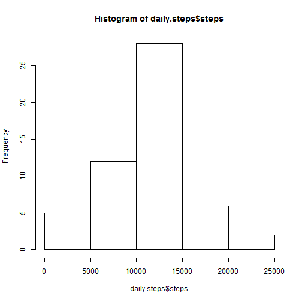
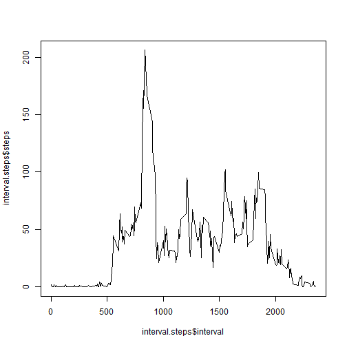
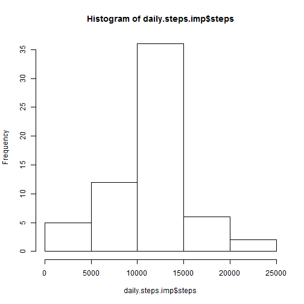

Kirk Allen
coursera Reproducible Research (Oct 2014)
Peer assignment #1
========================================================

Good morning, good afternoon, and good night. 

Let's get started.

Load package 'lattice' for plot at the end

```r
library(lattice)  # for the plot towards the end
```

Set local directory

```r
localdir = "H:\\Downloads"
setwd(localdir)
```

Download zip from URL, Unzip the file, and load it into data frame activity.data

```r
url <- "http://d396qusza40orc.cloudfront.net/repdata%2Fdata%2Factivity.zip"
download.file(url, "repdata-data-activity.zip", mode="wb")
activity.zip=unzip("repdata-data-activity.zip")
activity.data = read.csv(activity.zip)
```

Define new data frame where NAs are eliminated. Check the dimensions of original and new data.

```r
activity.data.noNA = activity.data[!is.na(activity.data$steps),]
dim(activity.data)
```

```
## [1] 17568     3
```

```r
dim(activity.data.noNA)
```

```
## [1] 15264     3
```

Sum the number of steps for each date. 

```r
daily.steps = aggregate(steps ~ date, data=activity.data.noNA, FUN=sum)
```

See mean and median daily steps

```r
mean(daily.steps$steps)
```

```
## [1] 10766
```

```r
median(daily.steps$steps)
```

```
## [1] 10765
```

Make a histogram of daily steps

```r
hist(daily.steps$steps)
```

 

Average daily activity pattern: 1. Calculate mean no. of steps per 5 minute period; 2. plot time series.

```r
interval.steps = aggregate(steps ~ interval, data=activity.data.noNA, FUN=mean)
plot(interval.steps$interval,interval.steps$steps,type="l")
```

 

Interval with the most steps: 835 (maybe this person walks to work at same time every day?)

```r
interval.steps[interval.steps$steps==max(interval.steps$steps),]$interval
```

```
## [1] 835
```


Now work on imputings NAs in original data.
First check how many NAs there are:

```r
dim(activity.data)[1] - dim(activity.data.noNA)[1]
```

```
## [1] 2304
```

Now make a data frame with only the NA rows. And check that is has same number of rows as the previous command:

```r
activity.data.NA = activity.data[is.na(activity.data$steps),]
dim(activity.data.NA)[1]  
```

```
## [1] 2304
```

Remove the column named steps (because we will replace/impute it )

```r
activity.data.NA = activity.data.NA[,-which(names(activity.data.NA)=="steps")]  
```

Merge NA rows with average steps by interval (data interval.steps above)
This means imputation by replacing NA with average for that interval

```r
activity.data.NA.impute = merge(activity.data.NA,interval.steps,by="interval")
```

Combine rows from imputed NAs with non-NA rows

```r
activity.data.imputed = rbind(activity.data.noNA,activity.data.NA.impute)
```

Sum by date and make histogram.

```r
daily.steps.imp = aggregate(steps ~ date, data=activity.data.imputed , FUN=sum)
hist(daily.steps.imp$steps)
```

 

Check mean and median on imputed dataset. 

```r
mean(daily.steps.imp$steps)    
```

```
## [1] 10766
```

```r
median(daily.steps.imp$steps)  
```

```
## [1] 10766
```

Seems that 8 days are entirely missing, so replacing with mean will not change mean

```r
table(activity.data.NA$interval)
```

```
## 
##    0    5   10   15   20   25   30   35   40   45   50   55  100  105  110 
##    8    8    8    8    8    8    8    8    8    8    8    8    8    8    8 
##  115  120  125  130  135  140  145  150  155  200  205  210  215  220  225 
##    8    8    8    8    8    8    8    8    8    8    8    8    8    8    8 
##  230  235  240  245  250  255  300  305  310  315  320  325  330  335  340 
##    8    8    8    8    8    8    8    8    8    8    8    8    8    8    8 
##  345  350  355  400  405  410  415  420  425  430  435  440  445  450  455 
##    8    8    8    8    8    8    8    8    8    8    8    8    8    8    8 
##  500  505  510  515  520  525  530  535  540  545  550  555  600  605  610 
##    8    8    8    8    8    8    8    8    8    8    8    8    8    8    8 
##  615  620  625  630  635  640  645  650  655  700  705  710  715  720  725 
##    8    8    8    8    8    8    8    8    8    8    8    8    8    8    8 
##  730  735  740  745  750  755  800  805  810  815  820  825  830  835  840 
##    8    8    8    8    8    8    8    8    8    8    8    8    8    8    8 
##  845  850  855  900  905  910  915  920  925  930  935  940  945  950  955 
##    8    8    8    8    8    8    8    8    8    8    8    8    8    8    8 
## 1000 1005 1010 1015 1020 1025 1030 1035 1040 1045 1050 1055 1100 1105 1110 
##    8    8    8    8    8    8    8    8    8    8    8    8    8    8    8 
## 1115 1120 1125 1130 1135 1140 1145 1150 1155 1200 1205 1210 1215 1220 1225 
##    8    8    8    8    8    8    8    8    8    8    8    8    8    8    8 
## 1230 1235 1240 1245 1250 1255 1300 1305 1310 1315 1320 1325 1330 1335 1340 
##    8    8    8    8    8    8    8    8    8    8    8    8    8    8    8 
## 1345 1350 1355 1400 1405 1410 1415 1420 1425 1430 1435 1440 1445 1450 1455 
##    8    8    8    8    8    8    8    8    8    8    8    8    8    8    8 
## 1500 1505 1510 1515 1520 1525 1530 1535 1540 1545 1550 1555 1600 1605 1610 
##    8    8    8    8    8    8    8    8    8    8    8    8    8    8    8 
## 1615 1620 1625 1630 1635 1640 1645 1650 1655 1700 1705 1710 1715 1720 1725 
##    8    8    8    8    8    8    8    8    8    8    8    8    8    8    8 
## 1730 1735 1740 1745 1750 1755 1800 1805 1810 1815 1820 1825 1830 1835 1840 
##    8    8    8    8    8    8    8    8    8    8    8    8    8    8    8 
## 1845 1850 1855 1900 1905 1910 1915 1920 1925 1930 1935 1940 1945 1950 1955 
##    8    8    8    8    8    8    8    8    8    8    8    8    8    8    8 
## 2000 2005 2010 2015 2020 2025 2030 2035 2040 2045 2050 2055 2100 2105 2110 
##    8    8    8    8    8    8    8    8    8    8    8    8    8    8    8 
## 2115 2120 2125 2130 2135 2140 2145 2150 2155 2200 2205 2210 2215 2220 2225 
##    8    8    8    8    8    8    8    8    8    8    8    8    8    8    8 
## 2230 2235 2240 2245 2250 2255 2300 2305 2310 2315 2320 2325 2330 2335 2340 
##    8    8    8    8    8    8    8    8    8    8    8    8    8    8    8 
## 2345 2350 2355 
##    8    8    8
```

```r
table(activity.data.NA$date)
```

```
## 
## 2012-10-01 2012-10-02 2012-10-03 2012-10-04 2012-10-05 2012-10-06 
##        288          0          0          0          0          0 
## 2012-10-07 2012-10-08 2012-10-09 2012-10-10 2012-10-11 2012-10-12 
##          0        288          0          0          0          0 
## 2012-10-13 2012-10-14 2012-10-15 2012-10-16 2012-10-17 2012-10-18 
##          0          0          0          0          0          0 
## 2012-10-19 2012-10-20 2012-10-21 2012-10-22 2012-10-23 2012-10-24 
##          0          0          0          0          0          0 
## 2012-10-25 2012-10-26 2012-10-27 2012-10-28 2012-10-29 2012-10-30 
##          0          0          0          0          0          0 
## 2012-10-31 2012-11-01 2012-11-02 2012-11-03 2012-11-04 2012-11-05 
##          0        288          0          0        288          0 
## 2012-11-06 2012-11-07 2012-11-08 2012-11-09 2012-11-10 2012-11-11 
##          0          0          0        288        288          0 
## 2012-11-12 2012-11-13 2012-11-14 2012-11-15 2012-11-16 2012-11-17 
##          0          0        288          0          0          0 
## 2012-11-18 2012-11-19 2012-11-20 2012-11-21 2012-11-22 2012-11-23 
##          0          0          0          0          0          0 
## 2012-11-24 2012-11-25 2012-11-26 2012-11-27 2012-11-28 2012-11-29 
##          0          0          0          0          0          0 
## 2012-11-30 
##        288
```

Now check weekdays vs. weekends. (For some reason my R language is French, so need to check for french version of Saturday & Sunday also!)

```r
activity.data.imputed$dayofweek = weekdays(as.Date(activity.data.imputed$date))

# define "weekend" column = 0 Mon-Fri and = 1 Sat&Sun
activity.data.imputed$weekend = "weekday"
activity.data.imputed[activity.data.imputed$dayofweek %in% c("Saturday","Sunday","samedi","dimanche"),]$weekend = "weekend"
```


Check the new variable weekend.

```r
table(activity.data.imputed$weekend)
```

```
## 
## weekday weekend 
##   12960    4608
```

```r
table(activity.data.imputed$weekend,activity.data.imputed$dayofweek)
```

```
##          
##           dimanche jeudi lundi mardi mercredi samedi vendredi
##   weekday        0  2592  2592  2592     2592      0     2592
##   weekend     2304     0     0     0        0   2304        0
```

Take mean for each interval stratified by weekend variable.

```r
weekend.intervals=aggregate(steps~weekend*interval*steps,data=activity.data.imputed,FUN=mean)
```

Make a panel plot (lattice package). Weekday steps are more peaked early in the morning (walking to work?), while weekend is more evenly spread throughout the day.

```r
xyplot(steps~interval|weekend,data=weekend.intervals,type="l",layout=c(1,2))
```

 


